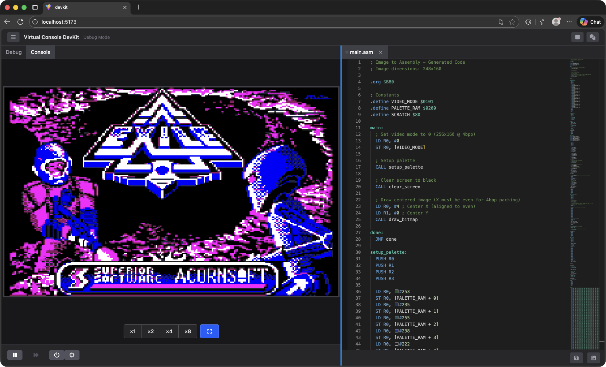
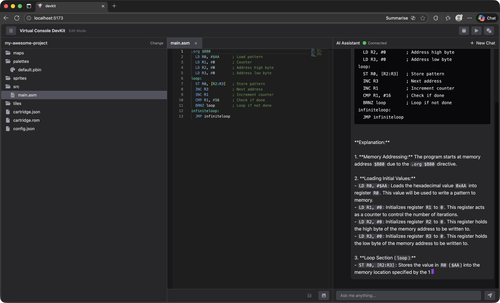

# Virtual Console

An 8-bit virtual console with a browser-based development kit and AI-powered coding assistant.





## Features

* A 3Mhz 6502-inspired CPU with a RISC twist
* 8bpp and 4bpp screen modes
* Access to linear video RAM
* Hardware sprites
* Tilemaps
* Collision detection
* Multi-channel audio
* AI assistant for writing and debugging assembly code

## Quick Start

### Prerequisites

- Node.js 18 or higher
- [llama.cpp](https://github.com/ggerganov/llama.cpp) (for local AI)

### 1. Install llama.cpp

**macOS (Homebrew):**
```bash
brew install llama.cpp
```

**Linux/Windows:** See [llama.cpp build instructions](https://github.com/ggerganov/llama.cpp#build)

### 2. Download a Model

Create a models directory and download a compatible model:

```bash
mkdir -p ~/models
wget -O ~/models/qwen2.5-coder-32b-instruct-q4_k_m.gguf \
  https://huggingface.co/Qwen/Qwen2.5-Coder-32B-Instruct-GGUF/resolve/main/qwen2.5-coder-32b-instruct-q4_k_m.gguf
```

This is a ~19GB download. Alternative smaller models:

```bash
# Qwen 14B (~8GB)
wget -O ~/models/qwen2.5-coder-14b-instruct-q4_k_m.gguf \
  https://huggingface.co/Qwen/Qwen2.5-Coder-14B-Instruct-GGUF/resolve/main/qwen2.5-coder-14b-instruct-q4_k_m.gguf

# Qwen 7B (~4GB)
wget -O ~/models/qwen2.5-coder-7b-instruct-q4_k_m.gguf \
  https://huggingface.co/Qwen/Qwen2.5-Coder-7B-Instruct-GGUF/resolve/main/qwen2.5-coder-7b-instruct-q4_k_m.gguf
```

### 3. Install Dependencies

```bash
cd src/devkit
npm run install:all
```

### 4. Configure Environment

```bash
cd api
cp .env.example .env
```

The default configuration uses llama.cpp with no additional setup required.

### 5. Start the DevKit

```bash
cd src/devkit
./start.sh
```

This starts:
- Two llama.cpp servers (chat on port 8080, codegen on port 8081)
- API server on http://localhost:3001
- DevKit UI on http://localhost:5173

Open http://localhost:5173 in your browser.

### Using Different Models

You can specify different models for chat and code generation:

```bash
# Use a smaller model for chat, larger for code generation
LLAMACPP_CHAT_MODEL=~/models/qwen2.5-coder-7b-instruct-q4_k_m.gguf \
LLAMACPP_CODEGEN_MODEL=~/models/qwen2.5-coder-32b-instruct-q4_k_m.gguf \
./start.sh
```

## Alternative AI Providers

### Using Anthropic API

1. Get an API key from https://console.anthropic.com/

2. Edit `api/.env`:
```env
AI_PROVIDER=anthropic
ANTHROPIC_API_KEY=your_api_key_here
ANTHROPIC_MODEL=claude-sonnet-4-5-20250929
```

3. Start the DevKit:
```bash
./start.sh
```

### Using AWS Bedrock

1. Configure AWS credentials:
```bash
aws configure
```

2. Ensure you have Bedrock access with Claude models enabled in your region.

3. Edit `api/.env`:
```env
AI_PROVIDER=bedrock
BEDROCK_REGION=eu-west-2
BEDROCK_MODEL_ID=arn:aws:bedrock:eu-west-2:YOUR_ACCOUNT:inference-profile/eu.anthropic.claude-sonnet-4-5-20250929-v1:0
```

4. Start the DevKit:
```bash
./start.sh
```

## Project Structure

| Folder | Description |
|--------|-------------|
| specs/hardware | Hardware specifications for the console |
| specs/implementation | Implementation instructions |
| specs/tools | Tool specifications (assembler, compiler, etc.) |
| src/console | Platform-agnostic console hardware (browser & Node.js) |
| src/devkit | React-based development kit with AI assistant |
| src/website | Public-facing demo website |

## Using the AI Assistant

The AI assistant can:
- Read and understand your assembly code
- Write assembly programs based on requirements
- Debug issues by inspecting CPU state and memory
- Control the debugger (step, run, breakpoints)
- Explain CPU architecture and instructions

### Example Prompts

- "Write a program that draws a red square"
- "Explain what this code does"
- "Help me find the bug - the sprite isn't moving"
- "Set a breakpoint at line 15 and step through"
- "What's in memory at address 0xA000?"

## Development

The code is implemented in TypeScript. See `specs/typescript-guide.md` for the style guide.

### Running Components Separately

```bash
# Terminal 1 - API Server
cd src/devkit
npm run dev:api

# Terminal 2 - Client
cd src/devkit
npm run dev:client

# If using llama.cpp, start servers manually:
llama-server --model ~/models/your-model.gguf --port 8080 --ctx-size 8192 --n-gpu-layers 99
llama-server --model ~/models/your-model.gguf --port 8081 --ctx-size 32768 --n-gpu-layers 99
```

## Troubleshooting

### llama.cpp server fails to start
- Check that the model file exists at the specified path
- Ensure you have enough RAM/VRAM for the model
- Try a smaller quantized model

### AI not responding
- Check that both llama.cpp servers are running (ports 8080 and 8081)
- Check API server logs for errors
- Verify `AI_PROVIDER` setting in `api/.env`

### Port already in use
- API port: Set `PORT` in `api/.env`
- Client port: Edit `client/vite.config.ts`
- llama.cpp ports: Edit `start.sh`

## License

MIT
